# Texto

A customizable Kotlin SMS/MMS app for Android by **[Addymore](https://github.com/Addymore)**, built on [QUIK](https://github.com/quik-sms/quik) and QKSMS. Reachable navigation, consistent public and private conversations, and a theme that feels like yours.

[Download 1.6.3](https://github.com/Addymore/Texto/releases/tag/v1.6.3) · [Changelog](CHANGELOG.md) · [Report a bug](https://github.com/Addymore/Texto/issues) · [Telegram](https://t.me/addymore)

**Two APKs:** choose the signed release APK for a new installation, or the debug APK to update a previous Texto development installation. Neither is a Google Play publication. Android 6+; physical OnePlus 13 / Android 16 and carrier validation are still required. See [validation](VALIDATION.md).

See the [complete feature list](docs/FEATURES.md) and [1.6.3 changelog](CHANGELOG.md).

## A look of your own

<table><tr><td>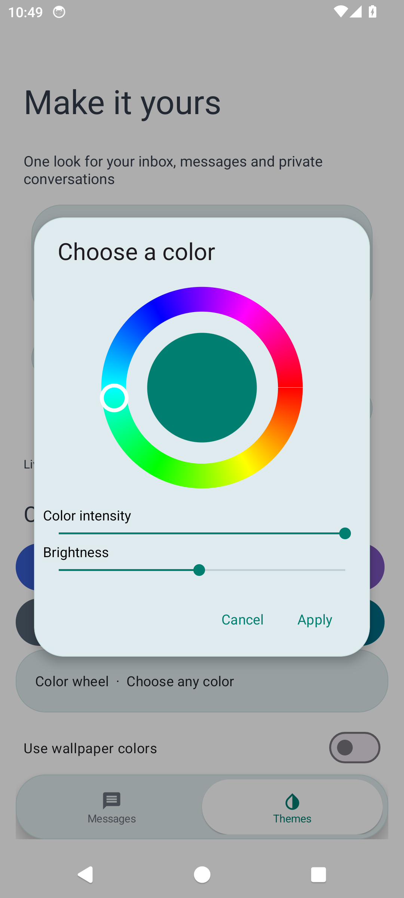</td><td>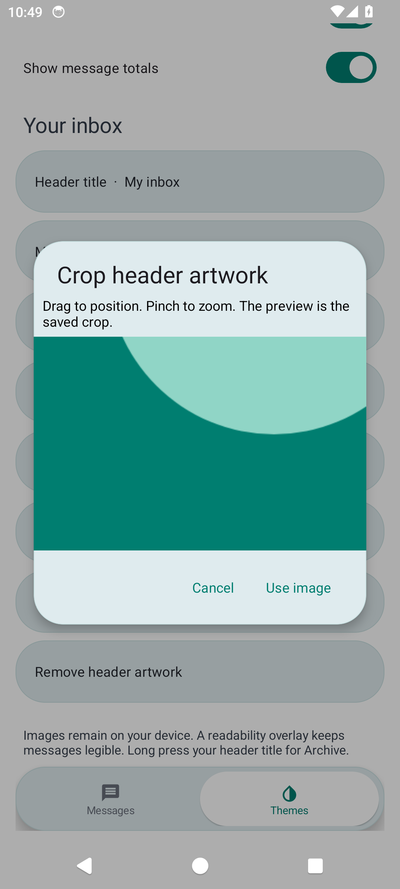</td></tr></table>

<table><tr><td>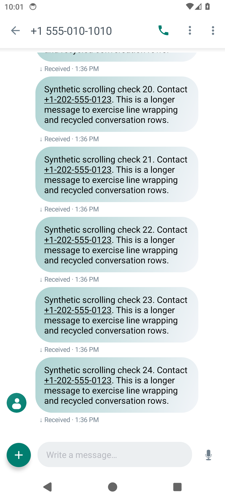</td><td>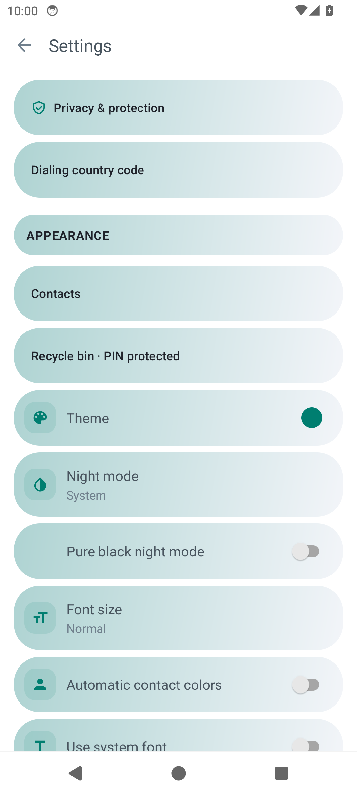</td></tr></table>

<table><tr><td>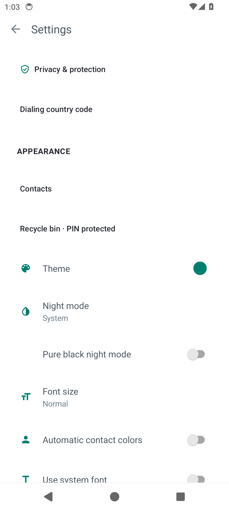</td><td>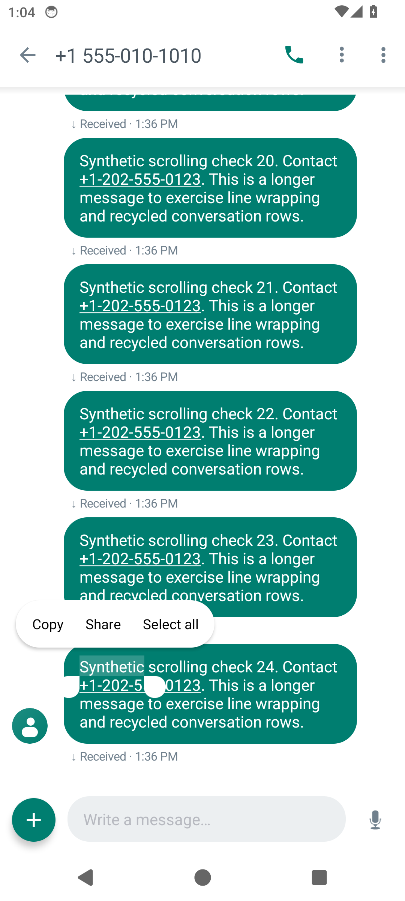</td><td>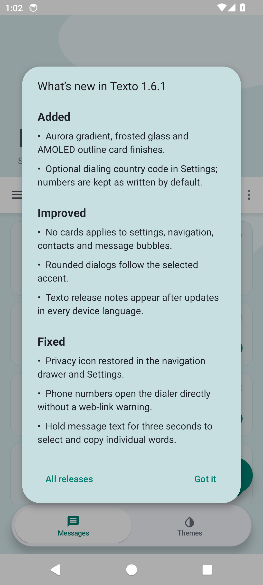</td></tr></table>

<table><tr><td>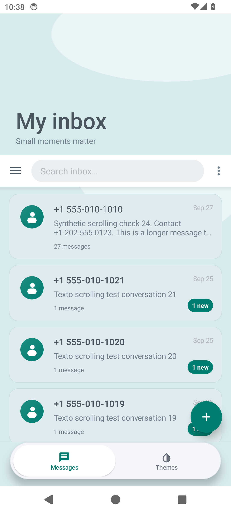</td><td>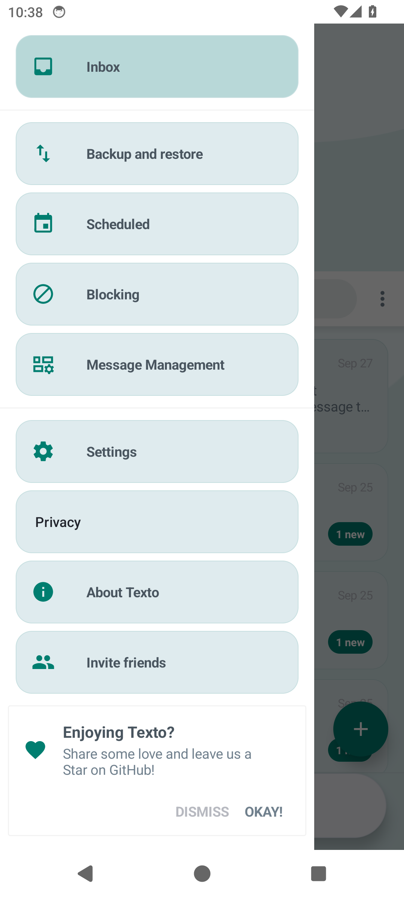</td></tr></table>

<table><tr><td></td><td></td><td></td></tr></table>

<table><tr><td>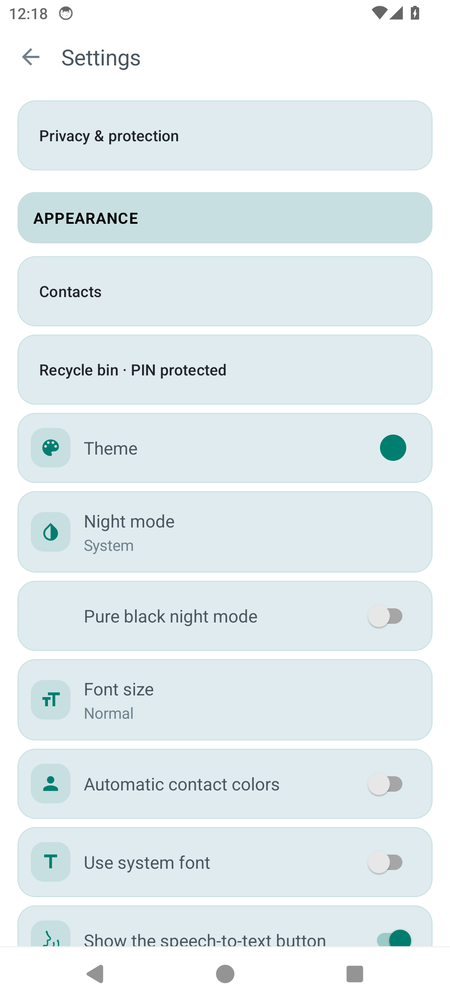</td><td>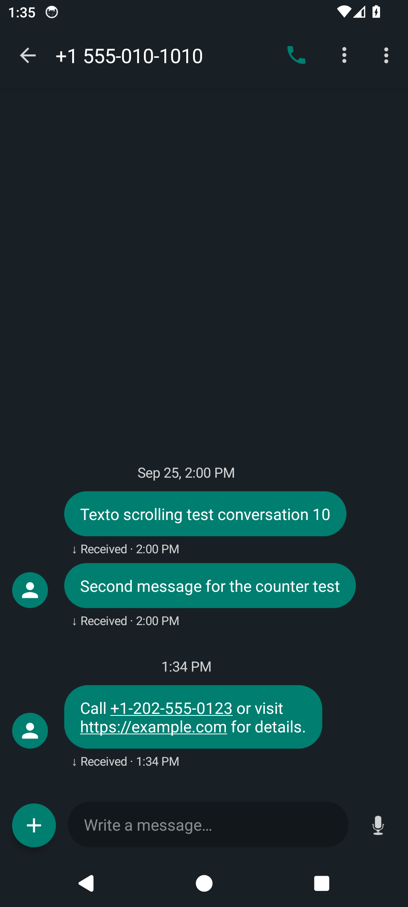</td></tr></table>

Screenshots use synthetic messages and sample contacts. Private screens are protected from capture.

- **Deliberate text selection.** A shorter long press selects the message; hold its text for three seconds to select words inside the bubble. Scrolling cancels the hold.
- **One consistent layout.** Public and private lists share conversation cards, avatars, dates, message totals and unread badges. Private SMS/MMS opens in the same full conversation screen.
- **Your header and artwork.** Custom inbox title and motto, separate background and header images, local image storage access and a readability overlay.
- **Flexible cards.** Small, medium or large cards; tonal, neutral, tinted, outlined or no-card conversation lists.
- **Scoped message tools.** Ordinary tools open without authentication. Privacy holds PIN/fingerprint-protected tools for locked, archived and selected numbers; public cleanup and exports exclude those numbers.
- **Photo-less avatars.** Gradient initials and modern geometric portraits, with real contact photos when available.
- **Personal themes.** Eight palettes, custom hex accents, wallpaper colors, light/dark/system appearance, AMOLED, card shapes and finishes, spacing, preview lengths, avatar/count toggles and unread dots or number badges.
- **Reachable navigation.** A collapsible large heading and floating Messages / Themes navigation. Settings is in the three-dot menu; Contacts lives in Settings.
- **Private conversations.** Persistent number rules, PIN/strong biometrics, silent notifications and exclusion from public search, widgets and shortcuts. Future messages from locked numbers stay private.
- **Recoverable deletion.** A protected recycle bin retains SMS/MMS attachments, with restore and 30/60/90-day expiry.
- **Control over unwanted messages.** Exact-number, prefix and phrase rules, trusted exceptions, a blocklist and recoverable quarantine.
- **The QUIK foundation.** SMS/MMS, group messages, attachments, dual SIM, scheduling, delayed sending, backups, reactions, search, pinning, speech and notification quick reply remain in the fork. Full device regression is not yet complete.

## SMS backup by email

Open Backup & restore, choose a writable folder, and create a backup. Select **Email a backup**, pick the saved JSON file, and choose your email app. To restore, download the attachment and select it with **Restore**. You choose the recipient and send it yourself. Ordinary backups and restores exclude protected/archived numbers; use Privacy for that scope. These files contain readable SMS text; MMS attachments, PINs and privacy rules are not included.

## Install

1. Download `Texto-1.6.3-release.apk` for a new install, or `Texto-1.6.3-debug.apk` to upgrade your development installation from the [release](https://github.com/Addymore/Texto/releases/tag/v1.6.3).
2. Install it and select Texto as your default SMS app. Allow the permissions needed for messaging and contacts.
3. Personalize it in **Themes** and configure your privacy PIN and number rules in **Settings → Privacy & protection**.

The signed release uses `app.texto.sms` and its own signing certificate. It installs separately from debug builds; configure the default-SMS role, PIN, privacy rules and themes again. The F-Droid build uses the same production package name but will have F-Droid's signature, so it cannot directly upgrade this GitHub-signed APK.

The development app ID is `app.texto.sms.debug`, so it can coexist with QUIK. An upgrade from an earlier Texto development build must use the same signing certificate. Keep a verified backup before replacing your primary SMS workflow.

## Privacy and limitations

Texto privacy is **app-level protection**, not encryption of Android's shared SMS/MMS provider. Other SMS-authorized apps, root access and exported backups are outside this protection. The bin keeps provider records until expiry; clearing Texto data removes its local deletion markers. Background cleanup may be deferred by Android.

RCS is not implemented: ordinary third-party SMS apps cannot provide the privileged carrier/OEM IMS integration it needs. SMS delivery reports depend on the carrier; SMS read receipts are not claimed. High-refresh display requests depend on your device and power settings.

See [privacy details](PRIVACY.md), [device checks](DEVICE-TESTS.md) and [validation results](VALIDATION.md).

## Build

Use **JDK 17**, Android SDK **34**, and the included Gradle wrapper. Set `sdk.dir` in a local `local.properties` file.

```sh
./gradlew :presentation:assembleDebug :common:testDebugUnitTest
```

On Windows:

```powershell
./build-texto.ps1
```

The Windows helper uses a short Unix-socket path for JDK 17. APK output is in `presentation/build/outputs/apk/debug/`. Release builds are unsigned by default so F-Droid can build and sign them; no signing keys are included. CI artifacts are independently debug-signed and are not guaranteed to upgrade a downloaded release APK.

## F-Droid

Texto has been submitted for [F-Droid review](https://gitlab.com/fdroid/fdroiddata/-/merge_requests/50918); the app is not listed there yet. See [packaging and installation notes](fdroid/README.md). The proposed package `app.texto.sms` installs separately from the development preview.

## Contribute and support

See [CONTRIBUTING.md](CONTRIBUTING.md). Report the Texto version, phone/Android version and reproduction steps. Remove real phone numbers and message contents from screenshots and logs.

Texto developer: **Addymore** · [Telegram @addymore](https://t.me/addymore).

## Credits and license

The 1.5 card treatment takes visual inspiration from [WA Enhancer 1.6.0](https://github.com/Dev4Mod/WaEnhancer/tree/1.6.0-b32a740d), implemented using Texto's existing theme system.

Texto derives from QUIK commit `4b942fe71ceaa56f43266de115d14aa5b30d99db`. Thank you to QUIK contributors, Moez Bhatti and QKSMS, and Jake and Luke Klinker for android-smsmms. Original notices and history are retained; [UPSTREAM.md](UPSTREAM.md) preserves the upstream README.

[GNU GPL v3 or later](LICENSE), consistent with inherited source notices. Corresponding source accompanies the APK. The design draws inspiration from Samsung Messages, iOS navigation and ColorOS; Texto is independent and is not affiliated with those vendors.

The 1.6.1 gradient, frosted and AMOLED finishes draw visual inspiration from custom Android ROMs such as [Project Infinity X](https://github.com/ProjectInfinity-X), rendered locally with Texto’s own accent colors.
